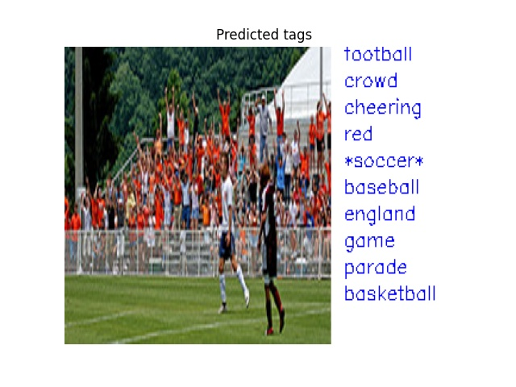

# Semantic Diversity Learning for Zero-Shot Multi-label Classification


[Pretrained models](MODEL_ZOO.md)

Official PyTorch Implementation

> Avi Ben-Cohen, Nadav Zamir, Emanuel Ben Baruch, Itamar Friedman, Lihi Zelnik-Manor<br/> DAMO Academy, Alibaba
> Group

**Abstract**

Training a neural network model for recognizing multiple labels associated with an image, including identifying unseen labels, is challenging, especially for images that
portray numerous semantically diverse labels. As challenging as this task is, it is an essential task to tackle since it
represents many real-world cases, such as image retrieval
of natural images. We argue that using a single embedding
vector to represent an image, as commonly practiced, is not
sufficient to rank both relevant seen and unseen labels accurately. This study introduces an end-to-end model training
for multi-label zero-shot learning that supports semantic diversity of the images and labels. We propose to use an embedding matrix having principal embedding vectors trained
using a tailored loss function. In addition, during training,
we suggest up-weighting in the loss function image samples
presenting higher semantic diversity to encourage the diversity of the embedding matrix. Extensive experiments show
that our proposed method improves the zero-shot model’s
quality in tag-based image retrieval achieving SoTA results
on several common datasets (NUS-Wide, COCO, Open Images).

#


## Semantic Diversiity Learning (SDL) Implementation
In this PyTorch [file](src\loss_functions\SDL_loss.py), we provide an
implementation of our semantic diversity learning (SDL) loss for zero shot multi-label classification.


## Pretrained Models
We provide a pre-trained model on NUS-WIDE dataset, which can be found in TODO 


## Inference Code
We provide an [inference code](infer.py), that demonstrates how to load our
model, pre-process an image and do actual inference. Example run:


```
python infer.py  \
--model_path=./models_local/NUS_mtresnet_224.pth \
--model_name=tresnet_m \
--pic_path=./pics/45820_163934428_128e9cfe08_m.jpg \
--top_k=10 \
```

which will result in:
#


Note that predicted "unseen" tags are indicated by * tag-name *.

### Training Code
We provide a [training code](train.py), that can be used to train our model. 
- The implementation in the provided training script is based on the [ASL repository](https://github.com/Alibaba-MIIL/ASL).
- The annotations should be provided in COCO format.
- To reproduce similar results to our paper results on COCO use the split provided in: [Zero-Shot Object Detection](https://ankanbansal.com/zsd.html).
- The annotation files are expected to be in the metadata path under "zs_split" folder.
- wordvec_array.pickle and cls_ids.pickle include coco word-vectors and seen-uneen class ids respectively, and should be located in the metadata path.
- The pretrained imagenet based backbone can be downloaded [here](https://miil-public-eu.oss-eu-central-1.aliyuncs.com/model-zoo/tresnet/tresnet_m.pth
)
- Run the following training args:
```
python train.py  \
--data=./data/COCO/ \
--model-path=./models/tresnet_m.pth \
--image-size=608 \
--pretrain-backbone=1 \
```

Note: the resolution is higher as we compared to object detection based methods that use similar or larger input size.

## Citation
```
@article{DBLP:journals/corr/abs-2105-05926,
  author    = {Avi Ben{-}Cohen and
               Nadav Zamir and
               Emanuel Ben Baruch and
               Itamar Friedman and
               Lihi Zelnik{-}Manor},
  title     = {Semantic Diversity Learning for Zero-Shot Multi-label Classification},
  journal   = {CoRR},
  volume    = {abs/2105.05926},
  year      = {2021},
  url       = {https://arxiv.org/abs/2105.05926},
  archivePrefix = {arXiv},
  eprint    = {2105.05926},
  timestamp = {Tue, 18 May 2021 18:46:40 +0200},
  biburl    = {https://dblp.org/rec/journals/corr/abs-2105-05926.bib},
  bibsource = {dblp computer science bibliography, https://dblp.org}
}
```

## Contact
Feel free to contact if there are any questions or issues - Avi Ben-Cohen (avi.bencohen@alibaba-inc.com) or Emanuel
Ben-Baruch (emanuel.benbaruch@alibaba-inc.com).
